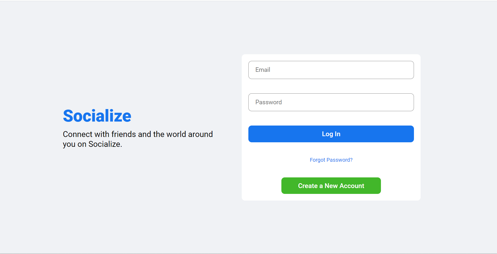
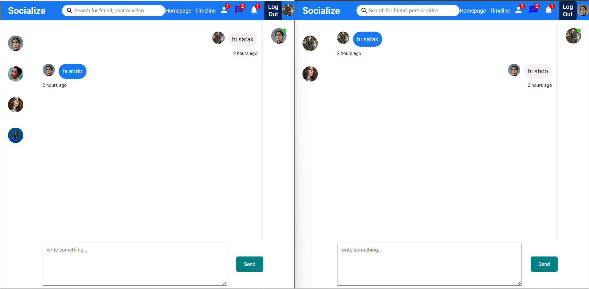

<!-- TABLE OF CONTENTS -->
<details>
  <summary>Table of Contents</summary>
  <ol>
    <li>
      <a href="#Messenger-application">About The Project</a>
      <ul>
        <li><a href="#built-with">Built With</a></li>
      </ul>
    </li>
    <li>
      <a href="#getting-started">Getting Started</a>
      <ul>
        <li><a href="#prerequisites">Prerequisites</a></li>
        <li><a href="#installation">Installation</a></li>
      </ul>
    </li>
    <li><a href="#usage">Usage</a></li>
    <li><a href="#contributing">Contributing</a></li>
    <li><a href="#App-Description">App Description</a></li>
    <li><a href="#acknowledgments">Acknowledgments</a></li>
  </ol>
</details>

<!-- ABOUT THE PROJECT -->

## Messenger application

Realtime chat application where you can add your friends and get connected with them. This project was created to learn the MERN stack along with WebSockets.

### Built With

- Front-end -> React.js, Axios, React-router-dom, Socket.io-client, Timeago.js, CSS.

- Back-end -> Node.js, Express.js, Bycrypt, Multer, Socket.io.

- Database-> MongoDB(Mongoose).

<!-- GETTING STARTED -->

## Getting Started

Front-end basically built with React.js, using Axios to make asynchronous HTTP requests to REST endpoints, handling routing with React-router-dom, for realtime chat using Websockets I used Socket.io-client in client side, using Timeago.js to estimate time created for message or post and finally styled the pages with CSS.

Back-end was built with Node.js and Espress.js, using Bycrypt to hash passwords, Multer to upload files and images to the server, Socket.io enables low-latency, bidirectional and event-based communication, finally used Mongoose as Mongo database.

### Prerequisites

- npm
  ```sh
  npm install npm@latest -g
  ```
- MongoDB
  ```sh
  https://www.mongodb.com/
  ```

### Installation

1. Clone the repo
   ```sh
   git clone https://github.com/A-Aboshahba/mern-messenger-app
   ```
2. Install NPM packages

   1. install Front-end packages

   ```bash
   cd front-end
   npm install
   ```

   2. install Back-end packages

   ```bash
   cd node-rest-api
   npm install
   ```

   3. install Socket.io packages

   ```bash
   cd socket
   npm install
   ```

3. Enter your MongoDB url in `node-rest-api/.env`
   ```js
   MONGO_URL = "mongodbUrl";
   ```
4. Enter proxy in `frontend/package.json`
   ```bash
    "proxy": "http://localhost:PORT/api/"
   ```

<!-- USAGE EXAMPLES -->

## Usage




Firstly, you need to craeate an account, find your friends and add them then you can go to the messenger page and chat with them, also you can see which friends of yours are online.

<!-- App Description -->

### App Description:

    1. you can register, login and logout.
    2. user can follow unfollow friends.
    3. user can send messages to any friend.
    4. user can show which friends are online.
    5. user can delete messages and chats.

<!-- CONTRIBUTING -->

## Contributing

Contributions are what make the open source community such an amazing place to learn, inspire, and create. Any contributions you make are **greatly appreciated**.

If you have a suggestion that would make this better, please fork the repo and create a pull request. You can also simply open an issue with the tag "enhancement".
Don't forget to give the project a star! Thanks again!

1. Fork the Project
2. Create your Feature Branch (`git checkout -b feature/AmazingFeature`)
3. Commit your Changes (`git commit -m 'Add some AmazingFeature'`)
4. Push to the Branch (`git push origin feature/AmazingFeature`)
5. Open a Pull Request

<!-- ACKNOWLEDGMENTS -->

## Acknowledgments

- [React.js](https://reactjs.org/docs/getting-started.html)
- [Axios](https://axios-http.com/docs/intro)
- [React-router-dom](https://reactrouter.com/en/main)
- [Socket.io](https://socket.io/docs/v4/)
- [Timeago.js](https://www.npmjs.com/package/timeago.js/v/4.0.0-beta.3)
- [CSS](https://www.w3schools.com/css/)
- [Express.js](https://expressjs.com/en/5x/api.html)
- [Multer](https://github.com/expressjs/multer)
- [Mongoose](https://mongoosejs.com/docs/)

<p align="right">(<a href="#readme-top">back to top</a>)</p>
